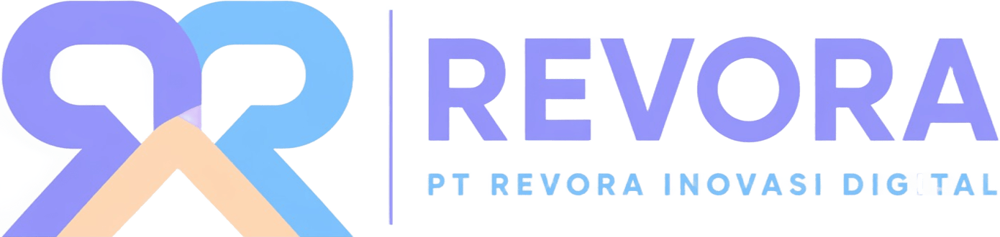

<div align="center">

  

  # PT Revora Inovasi Digital

  **Digital infrastructure, integrated systems, and field-ready software for modern operations.**

  <p>
    <a href="https://revora.co.id"></a>
    <a href="mailto:hello@revora.co.id"></a>
    <a href="https://revora.co.id/getstarted"></a>
  </p>

</div>

---

## ⚡ Build. Connect. Operate.

Revora membantu stakeholder merancang dan menjalankan sistem digital yang lebih siap dipakai di dunia nyata: stabil di sisi infrastruktur, rapi di sisi integrasi, dan relevan untuk kebutuhan operasional harian.

Kami berfokus pada tiga fondasi utama:

| Infrastructure | Integration | Digital Systems |
| --- | --- | --- |
| **Server infrastructure** yang andal, scalable, dan mudah dikelola. | **Software integration** untuk menyatukan aplikasi, data, perangkat, dan workflow. | **Pengembangan sistem digital** yang dibuat sesuai proses kerja bisnis dan lapangan. |

---

## 🚢 What We Ship

Revora mengembangkan solusi dari layer backend hingga aplikasi lapangan, dengan pendekatan yang praktis, modular, dan siap berkembang.

| Capability | What it enables |
| --- | --- |
| 🧑‍💻 **Custom Software Development** | Aplikasi web, dashboard, backend service, dan sistem internal sesuai kebutuhan organisasi. |
| 🛠️ **Infrastructure & Managed Services** | Setup server, deployment, monitoring, maintenance, dan pengelolaan environment produksi. |
| 📱 **Mobile & Field Applications** | Aplikasi untuk tim lapangan, input data, pelaporan, inspeksi, dan aktivitas operasional mobile. |
| 🏢 **Enterprise Digital Solutions** | Sistem bisnis, automasi proses, integrasi antar divisi, dan platform operasional skala organisasi. |
| 📡 **Data Acquisition & Processing Solutions** | Pengambilan, pengolahan, validasi, dan penyajian data dari berbagai sumber. |
| 🌿 **Environmental Monitoring Solutions** | Sistem pemantauan lingkungan berbasis sensor, data logger, dashboard, dan laporan berkala. |

---

## 🧠 How We Think

Teknologi yang baik bukan cuma terlihat modern. Ia harus bisa dipakai, dirawat, diintegrasikan, dan ditingkatkan tanpa menghambat kerja tim.

Karena itu, setiap solusi Revora dibangun dengan prinsip:

- **Operational first**: sistem mengikuti proses kerja nyata, bukan sebaliknya.
- **Integrated by design**: data dan aplikasi dirancang untuk saling terhubung sejak awal.
- **Reliable in production**: infrastruktur, deployment, dan monitoring menjadi bagian dari solusi.
- **Scalable when needed**: arsitektur dibuat cukup fleksibel untuk tumbuh bersama kebutuhan bisnis.

---

## 🧭 Product Direction

Kami membangun produk dan layanan di ranah:

```text
🧑‍💻 Custom Software Development
🛠️ Infrastructure & Managed Services
📱 Mobile & Field Applications
🏢 Enterprise Digital Solutions
📡 Data Acquisition & Processing Solutions
🌿 Environmental Monitoring Solutions
```

Lihat daftar produk lengkap di **`https://revora.co.id/products`**.

---

## 🤝 Connect

| Channel | Detail |
| --- | --- |
| 🌐 Website | `https://revora.co.id` |
| 🧭 About | `https://revora.co.id/about` |
| 🧱 Products | `https://revora.co.id/products` |
| 🚀 Get Started | `https://revora.co.id/getstarted` |
| ✉️ Email | `hello@revora.co.id` |
| 📱 Telp/WA | `+62 852-1310-1722` |
| 📍 Office | Menara Agrinas Palma, Lantai 15-03 Jl. H.R. Rasuna Said Kavling VI No 9 Blok X2, RT 9/RW 4 Kuningan Timur, Kec. Setiabudi, Jakarta Selatan, DKI Jakarta 12950 |
